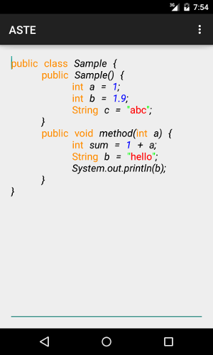

## Overview
Text field for Android with support for customizable syntax highlighting and autocompletion secretions code. Distributed under license LGPL v3 as a pluggable external library. Stated possibilities text editor, bold marked realized the problem:
* **Highlighting arbitrary syntax**
* **Flexible adjustment of colors**
* Highlighting arbitrary domains (errors, warnings)
* Autocomplete complementary characters
* Customizable line numbering
* Autocompletion code
* Supports context-sensitive language grammars
* A selection of styles for standard programming languages

The editor does not have a clearly defined syntax is and works with any kind of context-free grammars of language, such as Java, C / C ++, Python, PHP, and the like. In the future development of the lexical analyzer for context-sensitive language constructs. How it works? You load the library widgets and disposes it as a normal EditText, and then assign a style set for the keywords, constants, numbers, and pure text. After this, any text entered will be conducted through the lexical analyzer in the case of keywords be painted in the color you specify. For more detailed instructions on how to quickly set up see next secrion or if you want to understand the principles of the program or learn a list of functions, refer to the wiki.



## Quik Start
Download the package from a repository, place it in your project and set the widget SyntaxEditText convenient way through xml or software as a normal EditText. Then draw initialize it in the following way (for example Backlight Synaxis Java):
```java
        //Create an array of descriptions of keywords
        List<Keyword> keywords = new ArrayList<Keyword>();
        keywords.add(new Keyword("abstract", new FontStyle(1, "FF8C00", "Arial", false, false, false)));
        keywords.add(new Keyword("assert", new FontStyle(1, "FF8C00", "Arial", false, false, false)));
        keywords.add(new Keyword("boolean", new FontStyle(1, "FF8C00", "Arial", false, false, false)));
        keywords.add(new Keyword("break", new FontStyle(1, "FF8C00", "Arial", false, false, false)));
        keywords.add(new Keyword("byte", new FontStyle(1, "FF8C00", "Arial", false, false, false)));
        keywords.add(new Keyword("case", new FontStyle(1, "FF8C00", "Arial", false, false, false)));
        keywords.add(new Keyword("catch", new FontStyle(1, "FF8C00", "Arial", false, false, false)));
        keywords.add(new Keyword("char", new FontStyle(1, "FF8C00", "Arial", false, false, false)));
        keywords.add(new Keyword("class", new FontStyle(1, "FF8C00", "Arial", false, false, false)));
        keywords.add(new Keyword("const", new FontStyle(1, "FF8C00", "Arial", false, false, false)));
        keywords.add(new Keyword("continue", new FontStyle(1, "FF8C00", "Arial", false, false, false)));
        keywords.add(new Keyword("default", new FontStyle(1, "FF8C00", "Arial", false, false, false)));
        keywords.add(new Keyword("do", new FontStyle(1, "FF8C00", "Arial", false, false, false)));
        keywords.add(new Keyword("double", new FontStyle(1, "FF8C00", "Arial", false, false, false)));
        keywords.add(new Keyword("else", new FontStyle(1, "FF8C00", "Arial", false, false, false)));
        keywords.add(new Keyword("enum", new FontStyle(1, "FF8C00", "Arial", false, false, false)));
        keywords.add(new Keyword("extends", new FontStyle(1, "FF8C00", "Arial", false, false, false)));
        keywords.add(new Keyword("final", new FontStyle(1, "FF8C00", "Arial", false, false, false)));
        keywords.add(new Keyword("finally", new FontStyle(1, "FF8C00", "Arial", false, false, false)));
        keywords.add(new Keyword("float", new FontStyle(1, "FF8C00", "Arial", false, false, false)));
        keywords.add(new Keyword("for", new FontStyle(1, "FF8C00", "Arial", false, false, false)));
        keywords.add(new Keyword("if", new FontStyle(1, "FF8C00", "Arial", false, false, false)));
        keywords.add(new Keyword("implements", new FontStyle(1, "FF8C00", "Arial", false, false, false)));
        keywords.add(new Keyword("import", new FontStyle(1, "FF8C00", "Arial", false, false, false)));
        keywords.add(new Keyword("instanceof", new FontStyle(1, "FF8C00", "Arial", false, false, false)));
        keywords.add(new Keyword("int", new FontStyle(1, "FF8C00", "Arial", false, false, false)));
        keywords.add(new Keyword("interface", new FontStyle(1, "FF8C00", "Arial", false, false, false)));
        keywords.add(new Keyword("long", new FontStyle(1, "FF8C00", "Arial", false, false, false)));
        keywords.add(new Keyword("native", new FontStyle(1, "FF8C00", "Arial", false, false, false)));
        keywords.add(new Keyword("new", new FontStyle(1, "FF8C00", "Arial", false, false, false)));
        keywords.add(new Keyword("package", new FontStyle(1, "FF8C00", "Arial", false, false, false)));
        keywords.add(new Keyword("private", new FontStyle(1, "FF8C00", "Arial", false, false, false)));
        keywords.add(new Keyword("protected", new FontStyle(1, "FF8C00", "Arial", false, false, false)));
        keywords.add(new Keyword("public", new FontStyle(1, "FF8C00", "Arial", false, false, false)));
        keywords.add(new Keyword("return", new FontStyle(1, "FF8C00", "Arial", false, false, false)));
        keywords.add(new Keyword("try", new FontStyle(1, "FF8C00", "Arial", false, false, false)));
        keywords.add(new Keyword("static", new FontStyle(1, "FF8C00", "Arial", false, false, false)));
        keywords.add(new Keyword("strictfp", new FontStyle(1, "FF8C00", "Arial", false, false, false)));
        keywords.add(new Keyword("super", new FontStyle(1, "FF8C00", "Arial", false, false, false)));
        keywords.add(new Keyword("switch", new FontStyle(1, "FF8C00", "Arial", false, false, false)));
        keywords.add(new Keyword("synchronized", new FontStyle(1, "FF8C00", "Arial", false, false, false)));
        keywords.add(new Keyword("this", new FontStyle(1, "FF8C00", "Arial", false, false, false)));
        keywords.add(new Keyword("throw", new FontStyle(1, "FF8C00", "Arial", false, false, false)));
        keywords.add(new Keyword("throws", new FontStyle(1, "FF8C00", "Arial", false, false, false)));
        keywords.add(new Keyword("transient", new FontStyle(1, "FF8C00", "Arial", false, false, false)));
        keywords.add(new Keyword("try", new FontStyle(1, "FF8C00", "Arial", false, false, false)));
        keywords.add(new Keyword("void", new FontStyle(1, "FF8C00", "Arial", false, false, false)));
        keywords.add(new Keyword("volatile", new FontStyle(1, "FF8C00", "Arial", false, false, false)));
        keywords.add(new Keyword("while", new FontStyle(1, "FF8C00", "Arial", false, false, false)));
        keywords.add(new Keyword("\"", new FontStyle(1, "00FF00", "Arial", false, false, false)));
        keywords.add(new Keyword("'", new FontStyle(1, "00FF00", "Arial", false, false, false)));

        //Styling standard tokens
        FontStyle numbersStyle = new FontStyle(1, "0000FF", "Arial", false, true, false);
        FontStyle constStyle = new FontStyle(1, "FF0000", "Arial", false, false, false);
        FontStyle textStyle = new FontStyle(1, "000000", "Arial", false, true, false);

        //Assign by styles
        SyntaxEditText syntaxEditText = (SyntaxEditText) findViewById(R.id.set1);
        syntaxEditText.setKeywordList(keywords);
        syntaxEditText.setNumbersStyle(numbersStyle);
        syntaxEditText.setConstantsStyle(constStyle);
        syntaxEditText.setTextStyle(textStyle);
```
After these actions the component is ready for operation. This is the minimum that you need to do to make it work. For a list of supported attributes of the class, see wiki.

## Requirements and Limitations
The minimum version of the Android API - 11. At the lexical analyzer has a number of syntactic constraints. Keywords may not include characters that are typical of most control structures of programming languages - < > ( ) { } [ ] = ! . , | & + - * / and space.

## Links
[JavaDoc documentaton](https://cdn.rawgit.com/Serbis/ASTEL/master/astel/javadoc/index.html)
